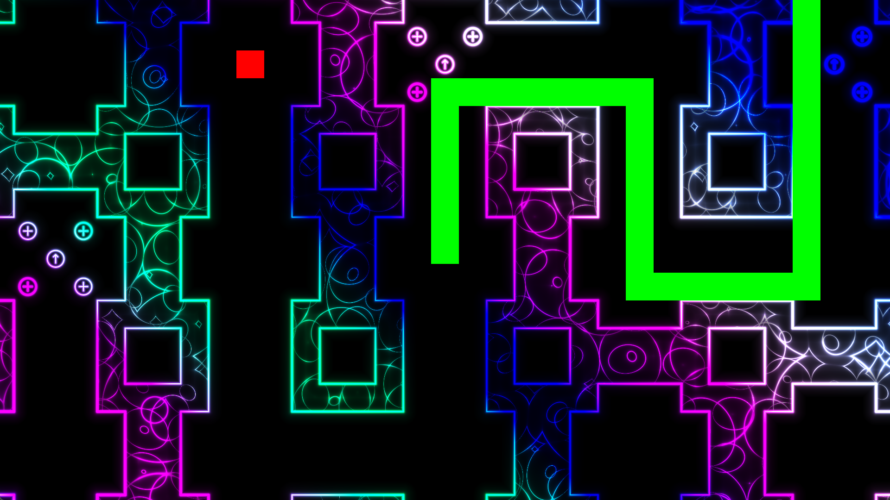
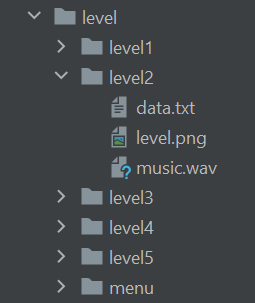
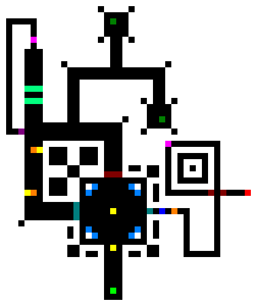

# Snake++

A continuation of Gnarwhal's submission for Ludum Dare 40



## How to Play

The game requires at least [Java 8](https://www.java.com/en/) to run.

To download the game, go to the [Releases](https://github.com/balduvian/snake-plus-plus-plus/releases) tab and download the latest release.

**Controls:**
* WASD - turn the snake
* Arrow keys - also turn the snake
* Space - retry/next level
* R - restart level

## Making Levels

### It's Super Easy

all of Snake++'s resources are easily accessible and modifiable to you from the `res/` directory.
You don't even need to have to build the project to modify it's resources. You can just grab the release and start modding.

If you made a good level that you would like to share, **please make a pull request** so it can be added to the project.
I'd love to see what you can create.

### Debug Mode

When developing levels, it will help to launch the game in debug mode. You can do this by providing the argument `--debug` or `-d` to the jar when you run it.
In debug mode, the game loads the level from disk each time it starts. This way, you can make changes in the level and see it reflected in the game without having to restart.
You may also provide the `-l {number}` or `--level={number}` flags to have the game start on a certain numbered level.

Debug mode also introduces new controls for selecting a level.
On the retry or continue screens, you may press the `,` or `.` keys to move backwards or forwards a level respectively. `Space` always restarts the current level.

### Level Format 

Each of Snake++'s levels are housed in the `res/level/` directory. Levels consist of a top level folder and some contents. One level per subfolder of the `res/level/` directory.
There is one special level named `menu` which is diplayed behind the menu of the game.
The rest of the levels follow the naming format `level{number}` where `number` is the sequential number of the level.
In the game, levels will be played in the order of their number.

There is no hardcoded number of levels in the game. You can add or delete as many as you want.

</img>

*Proper level folder structure*

### `data.txt`

Within each level folder is a file called `data.txt`. This file defines some additional parameters about the level apart from its physical construction.

Each line in `data.txt` is formatted as `{propertyName} = {value}`. The following is a guide to the required properties:

* `snakeSpeed` An integer defining the initial speed in tiles per second that the snake moves
* `snakeLength` An integer defining the initial length of the snake
* `palette` The colors used to render the level, the format can be found in the output of http://dev.thi.ng/gradients/
* `wrap` How to access the level out of bounds. `false` means the level will be bounded by walls. `true` means you can exit one side of the level and come out the other.

Example `data.txt`:
```
snakeSpeed = 7
snakeLength = 10
palette = [[0.241 0.158 0.987] [0.788 0.758 0.595] [1.136 1.551 0.674] [4.059 2.529 3.709]]
wrap = false
```

### `music.wav`

This file music that plays during the level. It should be in the wav format. No other configuration needed than that.

### `level.png`

Now we get the interesting part. This file visually defines the layout of the level.
It is recommended that you use a capable image editor where you can finely control each of the three color channels.
Note that this is the part where the most new features are going to be pumped into. The format may change with future development.

The size of `level.png` is the size of the level in game. Each pixel represents one tile. The color of the pixel defines what kind of tile it is, and some additional data about the tile.
The following is a guide on which colors correspond to which tiles.

|                                                          | Color      | Tile          | Description                                                       |
|----------------------------------------------------------|------------|---------------|-------------------------------------------------------------------|
|  | `0x000000` | Blank         | Nothing here, passable by the snake                               |
|  | `0xffffff` | Wall          | Not passable by the snake                                         |
|  | `0xff0000` | End           | The exit to the level                                             |
|  | `0xff7f00` | Speed Up      | A powerup that is collected to boost the snake's speed            |
|  | `0x0000ff` | Length Up     | A powerup that is collected to boost the snake's length           |
|  | `0xffff00` | Speed Down    | A powerup that is collected to decrease the snake's speed         |
|  | `0x007fff` | Length Down   | A powerup that is collected to decrease the snake's length        |
|  | `0xff00ff` | Switch        | Changes the level state from "on" to "off", affects on/off blocks |
|  | `0x007f7f` | On/Off Gate 1 | Passable only when state is "off", controlled by switch           |
|  | `0x7f0000` | On/Off Gate 2 | Passable only when state is "on", controlled by switch            |
|  | `0x007f00` | Apple         | Collect enough to pass through an apple gate                      |

### More Complicated Tiles

Some tiles are defined by more than just a single color. One of the channels is used to define data about the tile.

|                                                          | Red       | Green   | Blue    | Tile         | Description                                                                                             |
|----------------------------------------------------------|-----------|---------|---------|--------------|---------------------------------------------------------------------------------------------------------|
|  | `0x00`    | `0xff`  | `0 - 3` | Start        | Starts the snake in a direction specified by the blue channel (see Direction Codes)                     |
|  | `0 - 255` | `0xff`  | `0x7f`  | Apple Gate   | A gate which is only passeble after a number of apples specified by the red channel have been collected |
|  | `0x7f`    | `0 - 3` | `0x7f`  | One-Way Gate | A gate which is only exitable from the direction specified by the green channel (see Direction Codes)   |

#### Direction Codes
 * 0 - right
 * 1 - up
 * 2 - left
 * 3 - down

### Example Level Image

This image contains every type of tile. You can find it in the project as `level-example.png`.



## Building and Running

This project uses Kotlin v1.8.22, LWJGL v3.3.2, JOML v1.10.5

1. Open the project in [JetBrains IntelliJ IDEA](https://www.jetbrains.com/idea/download/#section=windows)
2. It should automatically setup the Gradle project
3. Click on the build dropdown and then `Edit Configurations...`
4. In the popup menu hit the `+` icon to Add a new configuration
5. Add a new `Gradle` configuration
6. In the `Run` box type in `run build`
7. Hit `Apply`
8. Then hit the green triangle run button

Additionally, if you want to launch in debug mode, in the Run box you can instead put `build run --args='--debug --level=5'` (or the number of whatever level you want to test)